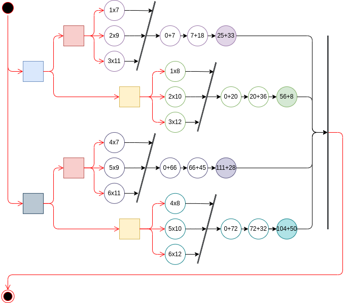

# Java Threads vs C/OpenMP implementations of parallel matrices multiplication

A series of implementations of matrices multiplication:
* Using Parallel Java Threads, Stream, and regular iterative computation.
* Using regular iterative C programming, and OpenMP library.
